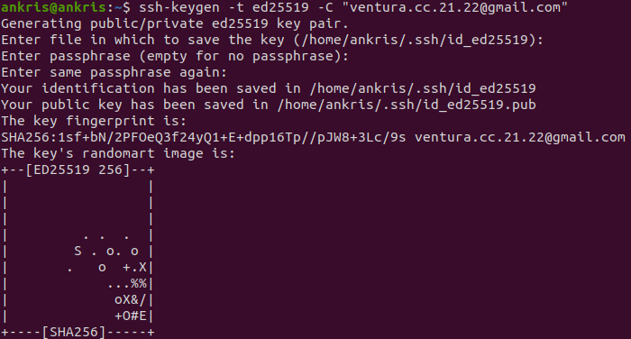
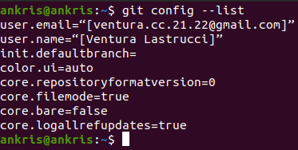
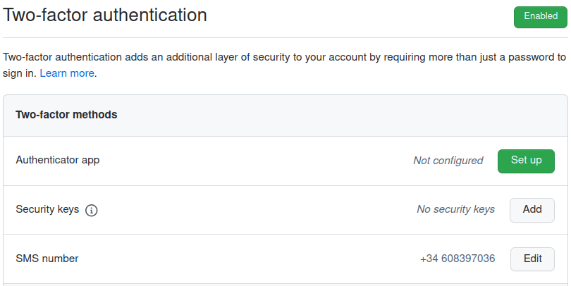

## Configuración de git

A continuación se explicarán los pasos realizados para la puesta apunto de git
y la conexión con los servidores de GitHub.

## Creación de par de claves y subida de clave pública a GitHub

Para ello crearemos un par de claves público/privada para poder realizar
una conexión con el repositorio ubicado en GitHub mediante ssh.
Lo primero que hay que hacer es generar las claves, para ello ejecutaremos
la siguiente orden en terminal:

```console
$ ssh-keygen -t ed25519 -C "ventura.cc.21.22@gmail.com"
```

Esto nos generará el par de claves a partir del correo configurado y
las almacenará en ficheros:



A continuación será necesario añadir las claves al agente ssh. Para ello
iniciaremos el agente ssh con la siguiente orden:

```console
$ eval "$(ssh-agent -s)"
```

Una vez iniciado, agregaremos la clave privada generada anteriormente (que se
encuentra almacenada en un fichero de nuestro sistema) al agente ssh con la
orden:

```console
$ ssh-add ~/.ssh/id_ed25519
```


Finalmente, tendremos que añadir la clave pública a nuestra cuenta de GitHub
para que se nos pueda autenticar como usuarios vía ssh. Para ello, en nuestro
perfil de GitHub nos iremos al apartado de *Settings* y dentro de este al
apartado *SSH and GPG keys*. Pulsaremos en el botón *New SSH key* y añadiremos
la clave pública que se encuentra en el fichero *~/.ssh/id_ed25519.pub*


Para comprobar que el proceso se ha hecho de manera adecuada, haremos una prueba
de conexión ssh, ejecutando la orden:

```console
$ ssh -T git@github.com
```

Ejecutada esta orden, si todo va bien, no dirá que hemos sido autenticados
con éxito:


## Configuración correcta del nombre y correo electrónico

Teniendo instalado git en el sistema el primera paso que hay que realizar es
asociar un correo y un usuario a git en nuestro sistema, que nos identificará
cuando hagamos cambios sobre el repositorio. Para ello basta con ejecutar las
siguientes órdenes:

```console
$ git config --global user.name "[Ventura Lastrucci]"
$ git config --global user.email "[ventura.cc.21.22@gmail.com]"
```
Una vez realizado esto, podemos ver que nuestra configuración ha sido modificada
ejecutando la siguiente orden por terminal:

```console
$ git config --list
```

Esto arroja el siguiente resultado:



## Edición del perfil de GitHub


## Incrementar la seguridad de nuestra cuenta en GitHub

