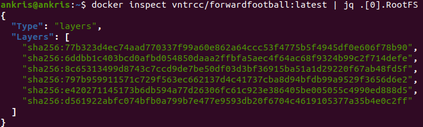
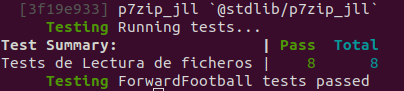

# Opciones del contenedor base

Las diferentes opciones contempladas teniendo en cuenta que el lenguaje de programación empleado es julia, son los siguientes:

## Ubuntu y Alpine

En primer lugar observemos la instalación del lenguaje haciendo uso de una imagen de un sistema operativo como [Ubuntu](https://hub.docker.com/_/ubuntu) o [Alpine](https://hub.docker.com/_/alpine). En ambos casos, los administradores de paquetes tienen acceso a una versión inferior de Julia (actualmente es la `v1.6.3` donde la `v1.7.0` está en etapa rc). En el caso de Ubuntu es la [versión `1.4.1`](https://www.ubuntuupdates.org/package/core/focal/universe/base/julia) y en Alpine es la [versión `0.5.2`](https://pkgs.alpinelinux.org/package/v3.6/community/x86_64/julia). Debido a esto, se tendría que proceder a la descarga e instalación del lenguaje Julia de la página oficial teniendo que instalar para ello los paquetes necesarios para la realización de este proceso. Debido a esto se ha considerado que hacer uso directamente de la imagen Docker de Julia es una opción más rápida y eficaz.

## Julia

Dentro de Julia hemos estudiado las siguientes imágenes:

```Dockerfile
FROM julia:1.6-alpine3.14
FROM julia:1.6-windowsservercore
FROM julia:1.6
```

### julia:<'version'>-alpine
Esta imagen está basada en el sistema operativo Alpine visto en el apartado anterior. Alpine Linux tiene un tamaño menor que la mayoría de contenedores base (~5MB), creando así imagenes de un tamaño más reducido. Esta variante es útil cuando el tamaño de la imagen es una parte importante en su diseño, pero al usar [musl libc](https://musl.libc.org/) en vez de [glibc](https://es.wikipedia.org/wiki/Glibc), es posible que el software encuentre problemas. De hecho podemos observar que al intentar compilar las dependencias encontramos fallos con el paquete `XLSX`:


Para solucionar este problema podemos proponer el cambio de formato de los ficheros de datos, de manera que se pueda prescindir de este paquete.

### julia:<'version'>-windowsservercore
Esta imagen esta basada en Windows Server Core, por lo que solo funciona en sistemas operativos como Windows 10 Professional/Enterprise (Anniversary Edition) o en Windows Server 2016. Al hacer uso de ubuntu como sistema operativo principal en el desarrollo de este proyecto, no considero de relevancia continuar en esta línea.

### jullia:<'version'>
Esta es la imagen de facto. Al no ser un experto en docker, el hacer uso de esta imagen parece ser lo indicado. Esta imagen está diseñada para usarse tanto como un contenedor desechable, así como de base para construir otras imágenes.

Las características a destacar son:

* El número de capas:

    

* El espacio que ocupa:

    

* Su ejecución:

    

    ...

    

Para más información acerca de las diferentes versiones que podemos emplear haga clic [aquí](https://hub.docker.com/_/julia).
