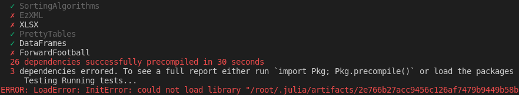
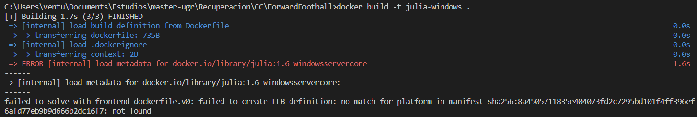
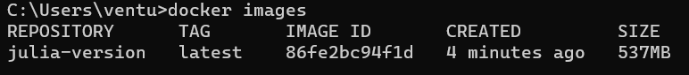

# Opciones del contenedor base

Las diferentes opciones contempladas teniendo en cuenta que el lenguaje de programación empleado es julia, son los siguientes:

## Ubuntu y Alpine

En primer lugar observemos la instalación del lenguaje haciendo uso de una imagen de un sistema operativo como [Ubuntu](https://hub.docker.com/_/ubuntu) o [Alpine](https://hub.docker.com/_/alpine). En ambos casos, los administradores de paquetes tienen acceso a una versión inferior de Julia (actualmente es la `v1.6.3` donde la `v1.7.0` está en etapa rc). En el caso de Ubuntu es la [versión `1.4.1`](https://www.ubuntuupdates.org/package/core/focal/universe/base/julia) y en Alpine es la [versión `0.5.2`](https://pkgs.alpinelinux.org/package/v3.6/community/x86_64/julia). Debido a esto, se tendría que proceder a la descarga e instalación del lenguaje Julia de la página oficial teniendo que instalar para ello los paquetes necesarios para la realización de este proceso. Debido a esto se ha considerado que hacer uso directamente de la imagen Docker de Julia es una opción más rápida y eficaz.

## Julia

Dentro de Julia hemos estudiado las siguientes imágenes:

- julia:1.6-alpine3.14
- julia:1.6-windowsservercore
- julia:1.6

### julia:<'version'>-alpine
***
Esta imagen está basada en el sistema operativo Alpine visto en el apartado anterior. Alpine Linux tiene un tamaño menor que la mayoría de contenedores base (~5MB), creando así imagenes de un tamaño más reducido. Esta variante es útil cuando el tamaño de la imagen es una parte importante en su diseño, pero al usar [musl libc](https://musl.libc.org/) en vez de [glibc](https://es.wikipedia.org/wiki/Glibc), es posible que el software encuentre problemas. De hecho podemos observar que al intentar compilar las dependencias encontramos fallos con el paquete `XLSX`:


Para solucionar este problema podemos proponer el cambio de formato de los ficheros de datos, de manera que se pueda prescindir de este paquete.

### julia:<'version'>-windowsservercore
***
Esta imagen se basa en Windows Server Core ( microsoft/windowsservercore) . Como tal, solo funciona en lugares en los que funciona esa imagen, como Windows 10 Professional/Enterprise (Anniversary Edition) o Windows Server 2016. Al ejecutar la imagen de julia cuya versión es acorde con la del proyecto y añadiendo el tag de `windowsservercore`, nos produce el siguiente error:


Para solucionar este problma podemos proponer la actualización de la versión a una más reciente, teniendo que actualizar la versión del proyecto realizando los cambios pertinentes en el código.

### julia:<'version'>
***
Esta es la imagen de facto. Esta imagen está diseñada para usarse tanto como un contenedor desechable (al disponer de un número mínimo de paquetes), así como de base para construir otras imágenes.

Para más información acerca de las diferentes versiones que podemos emplear haga clic [aquí](https://hub.docker.com/_/julia).

## Comparación de imágenes y Dockerfile

Partiendo de las imágenes anteriormente mencionadas y analizadas, y habiendo creado los distintos archivos de configuración, en otras palabras, los distintos Dockerfiles, realizaremos su comparación basándonos en dos características principales, espacio y tiempo. 

### Espacio
***
El espacio es un gran determinante principalmente por tres aspectos:

- Un menor espacio implica generalmente un menor número de bibliotecas o módulos instalados, lo que se traduce en menos posibles brechas de seguridad. A través de DockerHub podemos ver como las imágenes de mayor tamaño tienen una predisposición a tener más vulnerabilidades.
- Un menor espacio implica un mayor control sobre las bibliotecas empleadas y, por lo tanto, una mayor facilidad en su mantenimiento.
- Un menor espacio implica generalmente una mayor eficiencia y mejor rendimiento en cuanto a su construcción y uso de memoria.

Los `Dockerfiles` creados poseen prácticamente las mismas instrucciones, con el objetivo de optimizarlos aplicando una seria de buenas prácticas comentadas más adelante.

Específicamente, el `Dockerfile` creado para la imagen `julia:<version>` es el siguiente:

```docker
# Hacemos uso del contenedor base oficial de julia, con version 1.6
FROM julia:1.6

# Definimos el usuario sin privilegios
ENV USERNAME=ForwardFootball
ENV USER_UID=1000

RUN groupadd --gid ${USER_UID} ${USERNAME} \
    && useradd --uid ${USER_UID} --gid ${USER_UID} -m ${USERNAME} \
    && chown -R ${USER_UID}:${USER_UID} /home/${USERNAME}

# Definimos el directorio de trabajo
WORKDIR /ForwardFootball

# Copiamos los archivos necesarios para la ejecución de los tests
COPY Project.toml .
COPY make.jl .

COPY ./src/. src

COPY ./test/. test

# Ejecutamos el gestor de tareas
RUN julia make.jl

# Inizializamos el usuario sin privilegios
USER ${USERNAME}

# Definimos el comando a ejecutar cuando se inicializa el contenedor
CMD ["julia", "make.jl"]
```

Para optimizar la imagen consideremos las instrucciones empleadas:

- **FROM**: marca una nueva etapa de construcción estableciendo la imagen base.
- **USER**: establece el usuario para ejecutar los contenedores de la imagen. NUNCA utilizar un usuario root para nada, por motivos de seguridad. 
- **WORKDIR**: establece la dirección del directorio para la ejecución `RUN`, `CMD`, ... que la siguen. Existe un `WORKDIR` por defecto pero es mejor crear nuestra propia dirección de trabajo por nosotros mismos.
- **COPY**: copia archivos nuevos y directorios y los añade al sistema de archivos de la imagen. Hay que incluir el mínimo número de archivos necesarios.
- **CMD**: permite ejecutar comands una vez el contenedor se ha inicializado.

Tras crear las distintas imagenes y estudiado los diferentes errores que algunas de ellas producían, solo nos podemos quedar con la versión por defecto, `julia:<version>`:



De manera ilustrativa, mostremos una tabla con las distintas características:

Imagen | Build (s) | Tamaño | Ejecución media |
------ | --------- | ------ | --------------- |
julia-version | 53.2 | 537 MB | 30s (compilación), 2s (tests) |
julia-windowsservercore | Error de compilación | - | - |
julia-alpine | Error de compatibilidad de paquetes | - | - |
