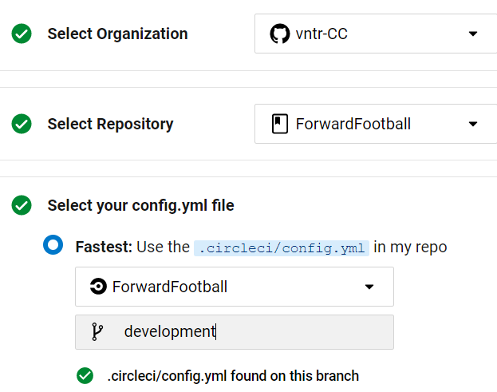
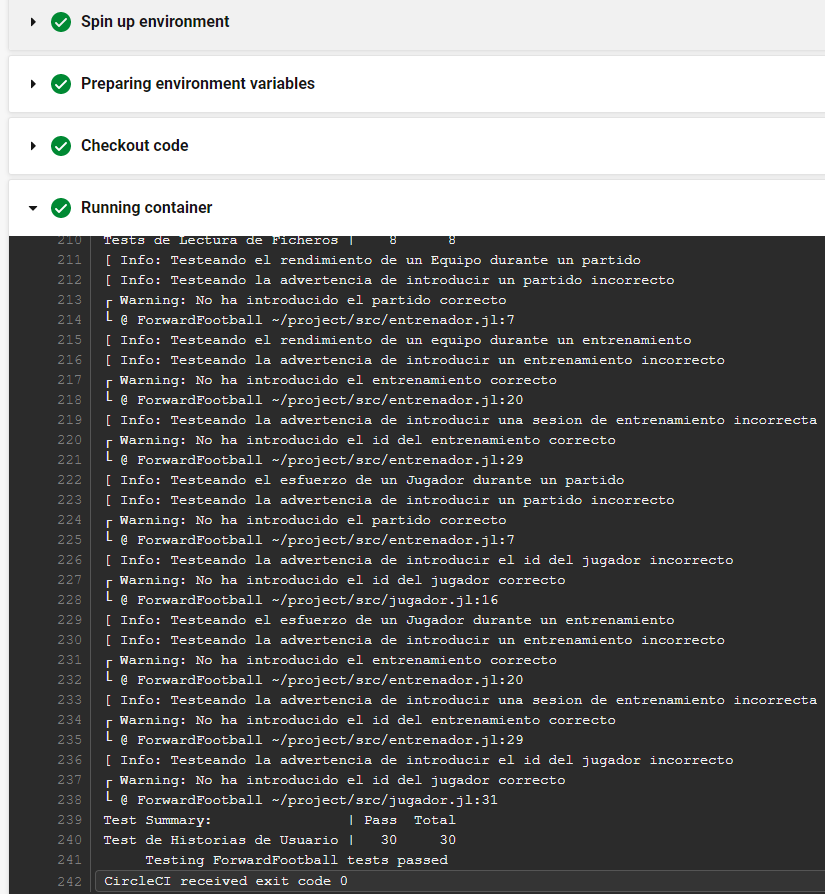
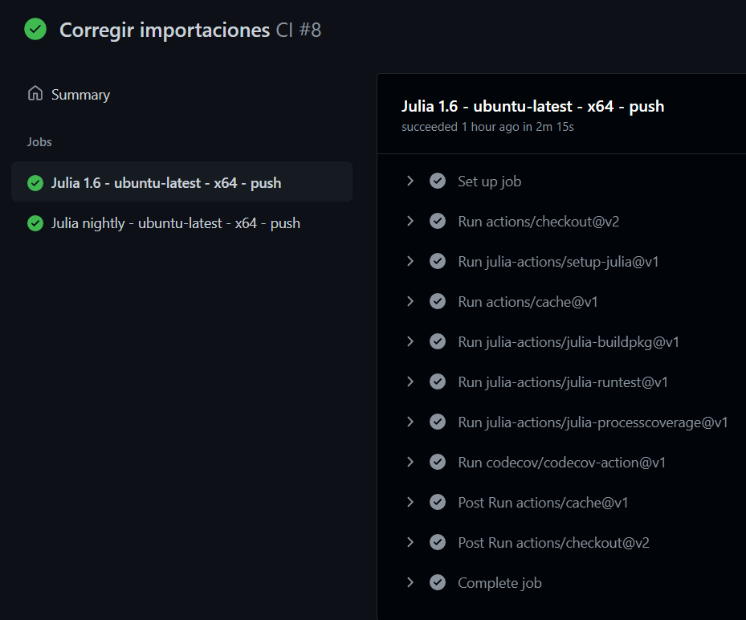
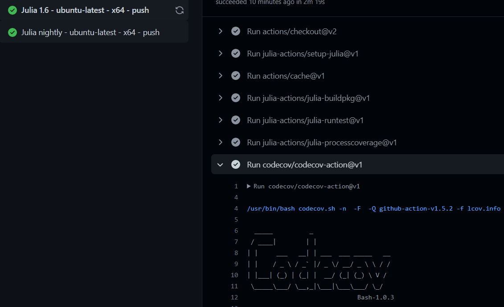
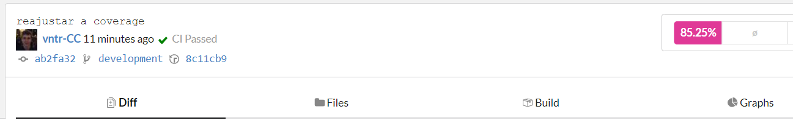

# Opciones de Gestor de Tareas 📓

Las diferentes opciones contempladas haciendo uso del lenguaje de programación Julia son las siguientes:

## Travis CI

Según [Wikipedia](https://en.wikipedia.org/wiki/Travis_CI):
> Travis CI es un servicio de integración continua alojado que se utiliza para crear y probar proyectos de software alojados en GitHub y Bitbucket. Travis CI fue el primer servicio de CI que brindó servicios a proyectos de código abierto de forma gratuita y continúa haciéndolo.

En un servicio que da soporte de forma general a muchos lenguajes para realizar la función de gestionar las tareas de manera continua, probando la integridad del proyecto en cada commit realizado y ejecutando las diferentes ordenes establecias en un archivo `.travis.yml` que tiene la siguiente estructura:

```yml
language: julia
julia:
  - nightly
  - 1.0.6
  - 1.5.2
...
jobs:
  allow_failures:
    - julia: nightly
after_success:
  - julia --project=test/coverage -e 'using Pkg; Pkg.instantiate()'
  - julia --project=test/coverage test/coverage/coverage.jl
```
Para más información acerca de este servicio clique [aquí](https://www.travis-ci.com/).

## Circle-CI

Circle-CI permite la integración de forma muy sencilla y facilita la creación de archivos de configuración legibles y complejos. Además dispone de varias imágenes oficiales pre-diseñadas, como las de docker, que permiten utilizar el entorno de docker sin configurar prácticamente nada.

Para poder disfrutar de esta herramienta, tenemos que registrarnos en Circle-CI,



Una vez que hemos iniciado sesión y hemos elegido el repositorio, automáticamente nos escaneará en busca del directorio `.circleci` que debería además contener un archivo de configuración de nombre `config.yml` como se ve en la siguiente imagen, en mi caso está en la rama development. El archivo de configuración tiene la siguiente forma:

```yml
version: 2.1
jobs:
  build:
    docker:
      - image: vntrcc/forwardfootball
    steps:
      - checkout
      - run:
          name: Running container
          command: julia make.jl
```
En este archivo primero definimos la versión de Circle-CI a emplear, siendo en este caso la 2.1. Posteriromente indicamos los trabajos a realizar, que en este caso al querer utilizar docker incluimos los campos `build` y `docker` y dentro de esta la imagen que queremos utilizar, es decir, la imagen creada por nosotros que pasa satisfactoriamente los tests. Finalmente indicamos una serie de pasos a realizar con esta imagen construida. Haciendo uso de la acción `checkout`, Circle-CI nos permite ejecutar comandos dentro del contenedor, siendo esta la misma que en el comando `CMD` que se encuentra en nuestro [Dockerfile](../../Dockerfile), `julia make.jl`. Comprobando su funcionamiento vemos que todo se ejecuta correctamente:



## Github Actions

Las plataformas mostradas anteriormente hacen uso de créditos para su funcionamiento, los cuales al acabarse tienen que ser repuestos. Por otro lado, a través de _GitHub Actions_ podemos definir un workflow que está exento de esta propiedad.

En el hito anterior definimos un workflow para [desplegar, construir y ejecutar](../hitos/Hito_3.md) el contenedor docker de los tests. Asimismo podemos definir un workflow que nos permita comprobar el funcionamiento de los tests de manera muy similar al archivo de configuración creado para Travis:

```yml
name: CI

on:
  push:
      branches:
        - main
        
jobs:
  test:
    name: Julia ${{ matrix.version }} - ${{ matrix.os }} - ${{ matrix.arch }} - ${{ github.event_name }}
    runs-on: ${{ matrix.os }}
    strategy:
      fail-fast: false
      matrix:
        version:
          - '1.6'
          - 'nightly'
        os:
          - ubuntu-latest
        arch:
          - x64          
    steps:
      - uses: actions/checkout@v2
      - uses: julia-actions/setup-julia@v1
        with:
          version: ${{ matrix.version }}
          arch: ${{ matrix.arch }}
      - uses: actions/cache@v1
        env:
          cache-name: cache-artifacts
        with:
          path: ~/.julia/artifacts
          key: ${{ runner.os }}-test-${{ env.cache-name }}-${{ hashFiles('**/Project.toml') }}
          restore-keys: |
            ${{ runner.os }}-test-${{ env.cache-name }}-
            ${{ runner.os }}-test-
            ${{ runner.os }}-
      - uses: julia-actions/julia-buildpkg@v1
      - uses: julia-actions/julia-runtest@v1
  ...
```
Donde comprobamos el funcionameinto de los tests bajo versiones distintas de julia utilizando la imagen de `ubuntu x64`. Posteriormente destacamos los pasos posteriores de `setup-buildpkg@v1` que se encarga de compilar los paquetes necesarios y `julia-runtest@v1` que se encarga de ejecutar los tests, pudiendolo comprobar en la siguiente imagen:



Adicionalmente para seguir las buenas prácticas de desarrollo, comprobaremos también el nivel de cobertura de los tests para el código que tenemos. Indica qué porcentaje de funcionalidad abarcan los tests, donde cuanto mayor mejor, ya que indicarán que nuestros tests son realmente útiles, necesarios y se puede confiar en que si se pasan, el riesgo de error será muy bajo. Para ello hemos usado la acción de codecov,

```yml
  ...
      - uses: codecov/codecov-action@v1
        with:
          file: lcov.info
```

Donde podemos ver el resultado del porcentaje cubierto por los tests:





## Appveyor

Según [Wikipedia](https://en.wikipedia.org/wiki/AppVeyor):
> AppVeyor es un servicio de integración continua alojado y distribuido que se utiliza para construir y probar proyectos alojados en GitHub y otros servicios de alojamiento de código fuente en una máquina virtual Microsoft Windows, así como máquinas virtuales Ubuntu Linux.

Es un servicio similar a Travis CI pero con mayor soporte en la comprobación de la integridad del proyecto en sistemas Windows. Para ello se ha de crear un archivo `.appveyor.yml` que tiene la siguiente estructura:

```yml
environment:
  matrix:
  - julia_version: 0.7
  - julia_version: 1
  - julia_version: nightly

platform:
  - x86 # 32-bit
  - x64 # 64-bit
```
Para más información acerca de este servicio clique [aquí](https://www.appveyor.com/).

***
**Aclaración**

La versión `nightly` hace referencia a la última versión de [Julia](https://github.com/JuliaLang/julia).

***

## Conclusión

Sin duda gracias a la completitud y a la personalización que ofrece, sin necesidad de ningún posible plan de pago, el mejor de los sistemas es _Github Actions_. Aunque puede que la configuración de los otros sistemas sea más sencilla, no tiene pérdida el poder despreocuparse de la ejecución de las actions cada vez que se hace un push al no tener ninguna cartera de créditos agotándose.