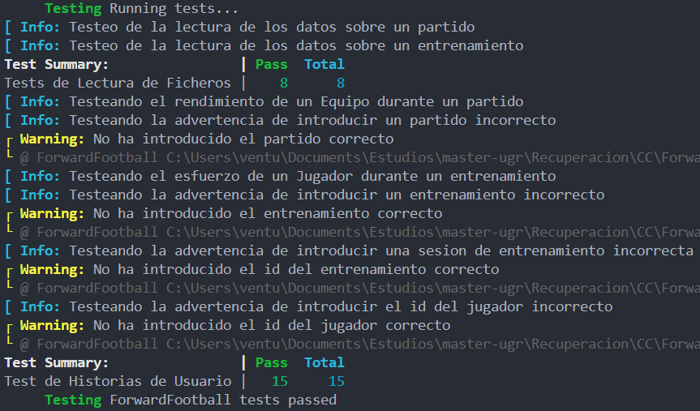

## Hito 2

Una vez conocido el proyecto a realizar (ver [Hito 0](Hito_0.md)), y conocido los diferentes roles, los escenarios, las primeras historias de usuario y los primeros milestones (ver [Hito 1](Hito_1.md)), es momento de definir el gestor de tareas que emplearemos e implementar los diferentes tests que van a cubrir el código del sistema.

* [Biblioteca de Aserciones](#aserciones)
* [Marco de Pruebas](#pruebas)
* [Gestor de Tareas](#tareas)
* [Tests realizados](#tests)
* [Documentación Adicional](#documentación-adicional)

<a name="aserciones"></a>
### 📚 Biblioteca de Aserciones 📚

Julia está en rápido desarrollo y tiene un extenso conjunto de pruebas para verificar la funcionalidad en múltiples plataformas. En este caso haremos uso del módulo **Test** en conjunto con **SafeTestsets** (para cumplimentar con el principio FIRST) para la definición de los diferentes tests que cubren los múltiples aspectos de la lógica de negocio e historias de usuario. Asimismo utilizaremos esta biblioteca de asercciones en base a la práctica _TDD_, ya que consideramos preferible que el desarrollador escriba los tests. Para ver la comparativa realizada con otras opciones haga clic [aquí](../extra/biblioteca_aserciones.md).

Comentar que al desarrollar el proyecto puramente en Julia, la necesidad de un archivo `build.jl` desaparece. Gracias al archivo del proyecto [`Project.toml`](../../Project.toml) que describe el proyecto a un nivel alto, conteniendo por ejemplo, las dependencias de los diferentes paquetes o las restricciones de compatibilidad. También en él se definen diferentes campos que nos permiten diferenciar los paquetes que necesitamos en las diferentes fases de compilación. En nuestro caso, al utilizar dos librerrías para los tests, definiendo sus dependencias bajo el campo `extras`, nos aseguramos que estas librerías solo se instalarán en el proceso de testeo del proyecto.

<a name="pruebas"></a>
### ✅ Marco de Pruebas ❎
Para utilizar y lanzar los tests en Julia, con el propio framework de `Test.jl` indicado anterioremente es posible. Teniendo Julia instalado y añadiendo el proyecto como paquete a un ecosistema de nuestra elección, o en el que se crea por defecto, los pasos para su ejecución son los siguientes:

1. Una vez abierto el REPL de Julia, presionamos `]`, en el teclado español se realiza mediante `AltGr + ]`, para entrar en el REPL del administrador de paquetes (para retornar presionar la tecla `Delete`). Luego indicamos el paquete a añadir que en nuestro caso es la dirección de este repositorio:

    ```Julia-repl
    (@v1.6) pkg> add https://github.com/vntr-CC/ForwardFootball.git
    ```
2. Una vez instalado, somos capaces de testearlo dentro del mismo REPL de la siguiente manera:
    ```Julia-repl
    (@v1.6) pkg> test ForwardFooball
    ```

<a name="tareas"></a>
### Gestor de Tareas 📓
Un [gestor de tareas o herramienta de construcción](https://jj.github.io/curso-tdd/temas/gestores-tareas.html):

> Permite usar, como subcomandos de un solo programa y especificados en un solo fichero, todas las tareas que se tienen que llevar a cabo con una aplicación, desde su compilación hasta la generación de la documentación pasando por todo lo necesario para ejecutar todo tipo de tests y desplegarlo.

En el lenguaje de programaciónn Julia, podemos hacer uso de [tareas](https://docs.julialang.org/en/v1/base/parallel/), es decir, funciones de flujo de control que permiten suspender y reanudar los cálculos de manera flexible. Pero para llevar a cabo la compilación, generación de la documentación y la ejecución de los tests, no es necesario definir tales tareas. Para ello hemos definido un archivo [make.jl](../../make.jl) que nos permitirá todo lo mencionado anteriormente con tan solo su ejecución con el siguiente comando,

```shell
julia make.jl
```

<a name="tests"></a>
### ✔ Tests realizados ✔

Los tests definidos hasta ahora comprueban las funcionalidades asociadas a la _HU2_ (_Como jugador, para perfeccionar mis capacidades, necesito poder conocer mi esfuerzo durante un entrenamiento sin tener que depender solamente del tiempo que me dedica el entrenador_) y a la _HU4_ (_Como entrenador, para mejorar mi equipo, necesito conocer el rendimiento de mis jugadores durante un partido sin tener que estar pendiente de todos ellos en todo momento_).

De esta manera para la _HU2_ se comprueba:
- Si el acceso a los datos del entrenamiento es posible.
- Si la lectura de los datos del entrenamiento es la correcta.
- Si se ha introducido la sesión de entrenamiento correcta, teniendo que ser un número entre 1 y 4.
- Si se ha introducido el id del jugador correctamente.
- Si las advertencias al introducir datos incorrectos es la correspondiente.

Por el otro lado para la _HU4_ se comprueba:
- Si el acceso a los datos del partido es posible.
- Si la lectura de los datos del partido es la correcta.
- Si las advertencias al introducir datos incorrectos es la correspondiente.

Ejecutando la tarea `Pkg.test()` dentro del archivo [make.jl](../../make.jl), obtenemos el siguiente _feedback_:



#### Cómo realizar tests

Se pretende realizar lso tests siguiendo el método FIRST (transparencias de JJ y blog.softtek.com)

**Principio FIRST**

- Fast: Permtie una rápida ejecución.
- Isolated: Cada test es independiente de otros test.
- Repeatable: Se puede repetir en el tiempo.
- Self-Validating: Cada test debe poder validar si es correcto o no a sí mismo.
- Timely: Desarrollar las pruebas antes que el código.

Además se seguirá la idea que se comprueban los comportamientos reflejados en las historias de usuario.

<a name="Additional"></a>
## Documentación Adicional

- [Hito 1](Hito_1.md)
- [Hito 3](Hito_3.md)
- [Inicio](../../README.md)
